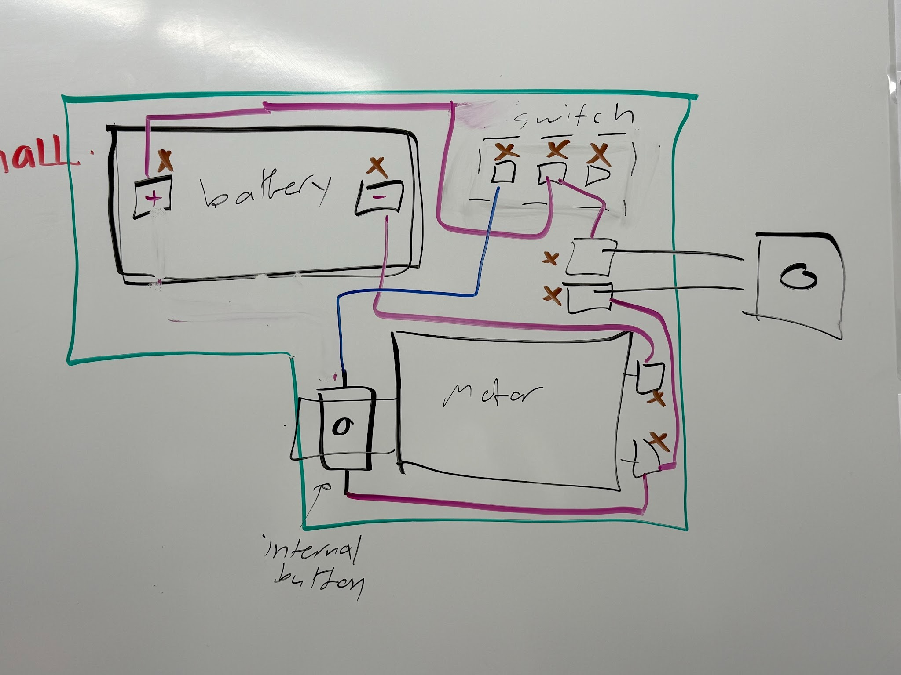
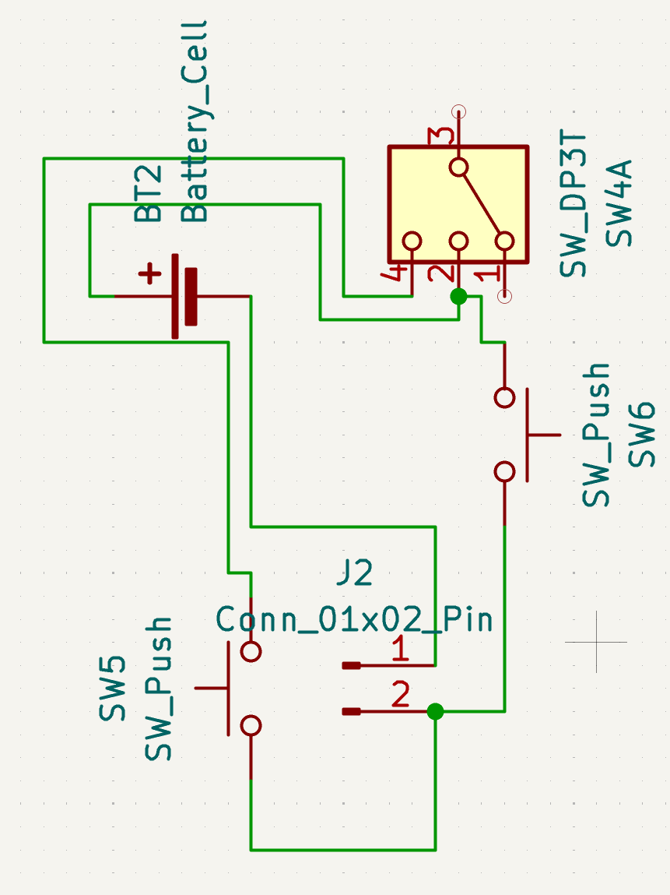

<!--Section 1: Introduce yourself-->
## ABOUT ME

Hello! I'm Michael Portillo, a Biomedical Engineering student with a passion for myoelectric prosthetics, powered exoskeletons, and humanoid robotics platforms, including interfaces that connect these devices to the human body.

I'm particularly motivated by the challenge of integrating biological signals with electromechanical systems to create device that restore or enhance movement, independence, and quality of life. I'm eager to engage in research and industry work that involves designing, prototyping, and testing medical mechatronic devices--from advanced prosthetic hands to wearable assistive robotics.

I'm excited to collaborate on projects that push the boundaries of human-robot interaction, control systems, and biomechanical design in healthcare technology.

<!--Mention your top/relevant skills here - core and soft skills-->
## SKILLS

**Computed-Aided Design**

I'm a CAD specialist with 5+ years of experience centered on mechanical design and rapid prototyping in competitive robotics and medical device design in a variety of software, along with creating proper engineering documentation and drawings; Onshape, SolidWorks, Fusion360.

**PCB Design**

I have 2+ years of experience in PCB design in KiCAD and Fusion360 centered on medical device projects.

**3D printing**

I have 3+ years of experience in 3D printing for various mechanically-related projects ranging from a coffee bean detection system to laparoscope storage clips and assembly fixtures.

**Programming**

I have 3+ years of experience in programming for a variety of projects ranging from statistics in R and matrix calculator in MATLAB to a ECG classifier machine learning program in Python.

**Bilingual U.S. Citizen**

I have fluency in both English and Spanish and am currently learning to speak Korean.

<!--Section 2: List 3-4 key projects-->
## PROJECTS

**Mechatronics Laparoscope PCB and Assembly Fixture**

.png)

The project was aimed at developing a PCB to fit required electrical components within a cavity inside a printed laparoscope encasing. The primary idea was to shift towards a system where a surgeon could simply press a button to actuate a mechanical wiper to clean the lens of a laparoscopic device to shorten procedure times and improve surgical safety.

.png)

Coupled with the PCB, the second aspect of the project entailed designing an assembly fixture for the traditional version of the laparoscopic cleaning device. A rotating wire holder inside the device needed to be placed into a very specific cavity and orientation and this fixture allowed for easy manipulation and placing of the piece within a tolerance of +-0.005 inches.

**Echocardiogram PCB**

.png)
.png)

The project was aimed at designing and testing low-pass filters, high-pass filters, voltage followers, and instrumentation amplifiers to create a PCB to act as an echocardiogram. As a two-person project, I contributed to designing the necessary circuits in Fusion360 and calculating the values of the resistors and capacitors used to obtain the necessary output, which was tested successfully on an ELVIS II board. Lastly, I soldered the instrumentation amplifiers onto the ordered board.

**Active Intake Mechanism and Scissor Life: 2025 VEXU Robotics**

.png)
.png)

The project was aimed at designing and manufacturing a robot capable of placing ring-shaped objects onto stakes to place into specific areas on a 12-foot-by-12-foot field in addition to climbing a ladder for points in a given match. As a mechanical team leader, I contributed to the design of the intake roller mechanism to transfer rings to a conveyor mechanism used to score rings on stakes, which ended up being one of the most efficient systems on the robot. Additionally, I worked alongside an Aerospace PHd student to design and build a scissor lift to reach the top of the ladder and lift the robot above the highest rung on the ladder. In competition, the team was state finalists with myself as the primary robot driver and became 2025 VEX AI World Champions.

**Linear Slider Climber and Tail Scooper: 2024 VEXU Robotics**

.png)
.png)
.png)

The project was aimed at designing and manufacturing a robot capable of moving triangular-shaped game objects underneath rectangular goals and climbing a vertical PVC pipe for points in a given match. As a mechanical team leader, I contributed to the design of the linear slider climbing mechanism, which employed linear sliders often seen in FTC, pulleys, and a motor-driven spool to deploy the system. Coupled with a gripping claw, the robot was able to climb up to the third-highest vertical position on the pipe. Additionally, I contributed to the design of a tail scooping mechanism, which took game pieces out of a loading station placed in corners of the field to successfully introduce them into matchplay. In competition, the team became 2024 VEX AI World Champions.

**Forklift Rotation Climber: 2023 FIRST Robotics Competition**

.png)

The original project was aimed at creating a robot capable of picking up traffic cones and inflated deformed cubes to place onto metal rods and steps of stairs for points in a given match. While this was an off-season project, I designed an entire climbing mechansim composed of rods that sit towards the back of the robot to deploy underneath a partner robot on a tilting platform to life off of the ground via rotation and mechanical advantage. I personally calculated all gearbox ratios to produce the necessary torque to rotate a 105-pound robot off the floor, ran stress-tests on carbon-fiber rods to ensure they could withstand the lateral force in Fusion360, and made CAD drawings of each component needed. While the design wasn't manufactured, it was entirety approved by two mechanical mentors each with 8+ years of industry experience.
